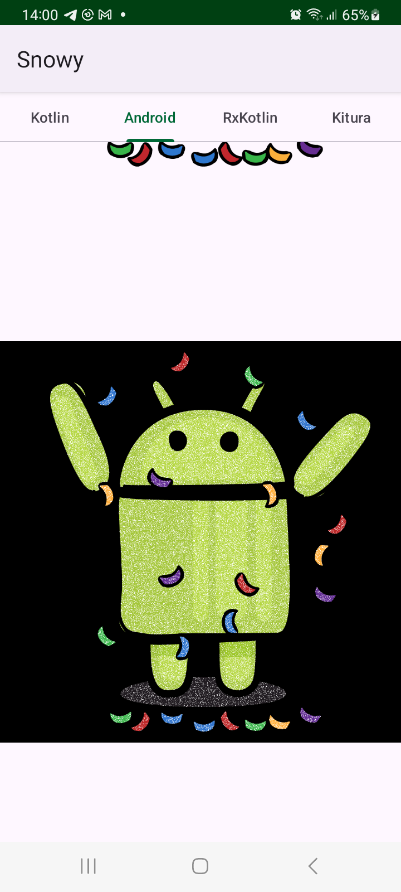

# Snowy

App applies filter to source images that makes them look like they are covered with falling snow.

- All 'heavy' calculations are made inside of **coroutines**, created with either **launch** or with **async**  
- Calculations of snowy images are done inside IO thread pool - context switched with  **withContext(Dispatchers.IO)** 
- **ViewPager2** with **FragmentStateAdapter** are used to create scrollable tabs in the app. 

  
  

